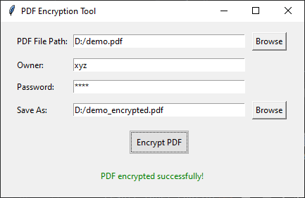
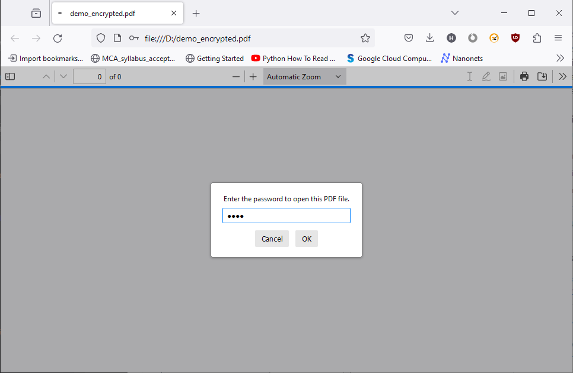

# PDF-Encryptor
The PDF Encryption Tool is a user-friendly desktop application that allows users to encrypt PDF files securely. The application provides a simple and intuitive graphical interface to enhance user experience.

